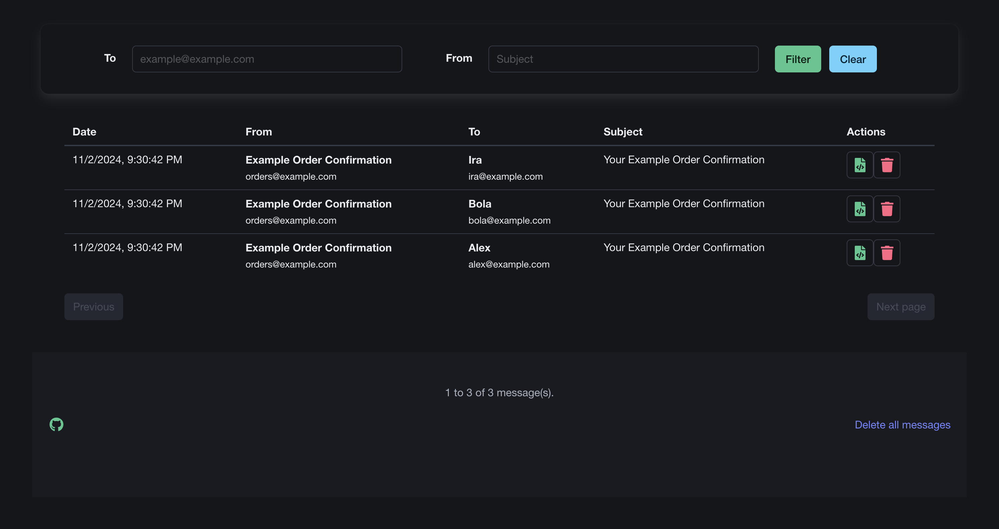

# SendGrid Mock


Provides a service that simulates the sending mail endpoint provided by SendGrid API that may only be used for
development purposes.

It contains a simple UI where you can see all received mails, delete or check its content.



## API

* `POST /v3/main/send`: SendGrid like sending mail endpoint
* `GET /messages`: search persisted messages
  * Query parameters:
    * `to`: filter by to address (accepts `%` wildcard)
    * `subject`: filter by subject (accepts `%` wildcard)
    * `page`: paginate results starting from `0`
    * `rows`: number of rows returned on each page
* `GET /messages/:event_id`: return message content
  * Path parameter:
    * `event_id`: event identifier
  * Query parameter:
    * `format`: must be `html` or `text`
* `DELETE /messages/:event_id`: delete message
  * Path parameter:
    * `event_id`: event identifier
* `DELETE /messages`: delete all messages

## Events

There is a basic support for events, currently sending (when enabled) one of these events:

* **delivered**: when the message was persisted in the database;
* **dropped**: when some failure occurs when persisting in the database;

## Configuration

There are some customization possibles, all of them are defined by using the system environment.

* **API_KEY**: Used to authenticate the sending mail endpoint;
* **EVENT_DELIVERY_URL**: when defined, it used for event sending;
* **MAIL_HISTORY_DURATION**: duration, using Golang pattern, which is used to delete messages older than that duration;
* **STORAGE_FILE**: when defined, instead of creating a randomized temporary file, the given file name will be used;

## Container (Docker)

```shell
docker run -p 3000:3000 --rm ghcr.io/rapatao/sendgrid-mock:${version:-latest}
```

## Notes

This service/repository should not be used as a studying reference since it isn't using any good development practice,
neither have tests implemented. It was built with the intention to provide a service that should be used for development
purposes only.
